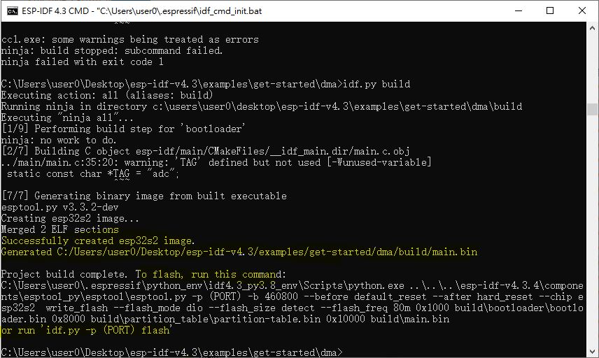

# ESP32_DMA_ADC_testing  

my copy and the original CC 4.0 as following, CSDN was a bit without user friendly, copy code was not easy as the github  

author and the words for code design,  
[ESP32S2_ADC_Moliam.pdf](ESP32S2_ADC_Moliam.pdf)  

### try [Arduino_esp32_dma_adc_failed](Arduino_esp32_dma_adc_failed) to gen code
esp32_dma_adc.h
esp32_dma_adc.ino
add following to the source code
```
//版权声明：本文为博主原创文章，遵循 CC 4.0 BY-SA 版权协议，转载请附上原文出处链接和本声明。   
//本文链接：https://moliam.space/2021/11/17/experience/esp32/adc_dma/  

// code and origin, https://blog.csdn.net/weixin_44529321/article/details/115082805
// copy, xiaolaba 2022-OCT-14

#include "esp32_dma_adc.h"
```


### use IDF 4.3.4 to build, ok
build will fails when set target default to esp32, esp32-s2 has to be, otherwise error "no soc/system.h" or something.  
steps,
```
idf.py set-target esp32-s2
idf.py build

```

```
add some code and whole project file
```

### full source code and compilable project files - [dma](dma)  
download the project files to C:\Users\user0\Desktop\esp-idf-v4.3\examples\get-started\dma  
the result, but no harware could be used to test yet at the moment.  
  
